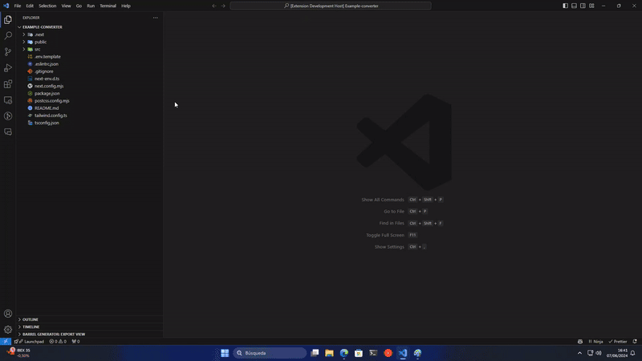
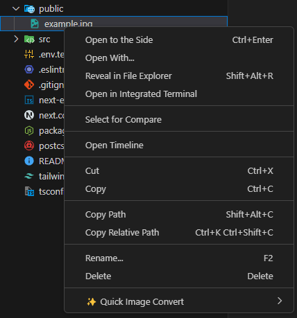
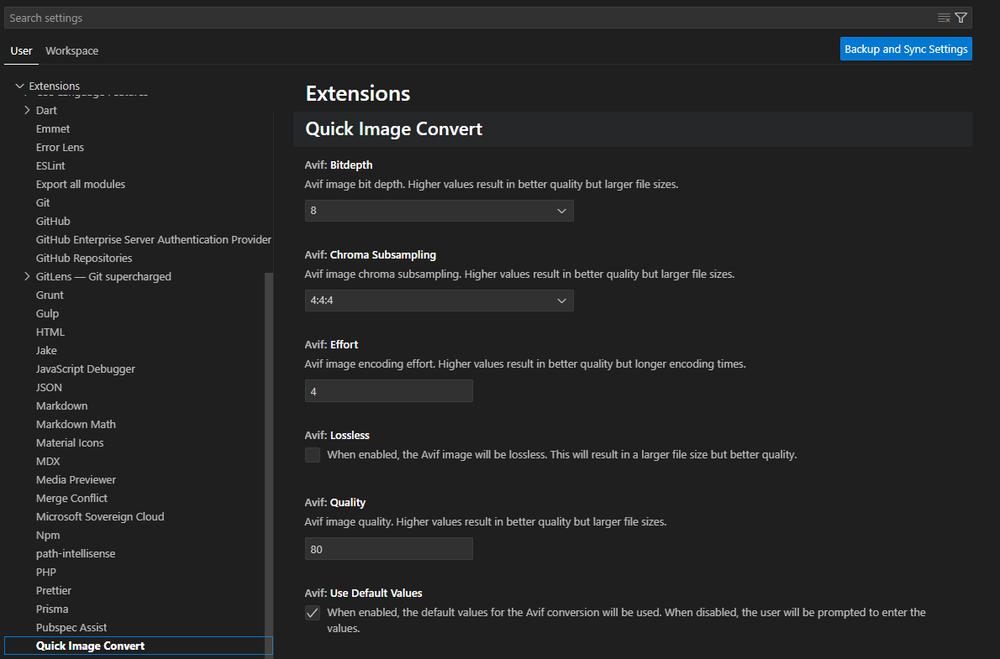

<b>Quick Image Convert</b> is a VSCode extension   that facilitates image conversion. 🖼️➡️📂 Simply   right-click on an image and select the format you need. ⏱️🔄

Ideal for developers and designers looking for efficiency  in their workflow. 💻🎨

# ⚡️ Quick start

1. Select an image: Navigate to the image you want to convert in your file explorer within VSCode.

2. Right-click on the image.

3. Select “Quick Image Convert”.

4. Choose the output format

5. Done! The converted image will be saved in the same folder as the original.

# 🚀 Features

- **Quick Conversion:** Convert images to popular formats like PNG, JPEG, WebP, and AVIF with a single click.

- **Image Optimization:** Reduce file size without losing quality to improve web performance.

- **Support for multiple formats:** Convert images to different formats according to your needs.

# 🎨 Customization

**Quick Image Convert** allows you to customize the extension according to your preferences. Go to the settings in VSCode and search for **“Quick Image Convert”**.

**Important** 📌: You can disable the **“use Default Values”** option so that the extension asks you for the conversion parameters each time you use it.

# 📚 Supported formats

- **AVIF:** High-quality image format with efficient compression.

- **WebP:** Modern and lightweight image format.

# 🎯 Motivation to create

**Quick Image Convert** was born out of the need to simplify the conversion of images to more efficient formats like AVIF and WebP. 🖼️➡️📂 These formats are known for their ability to significantly reduce file size without losing quality, resulting in faster loading and better web performance. 🌐⚡

As developers and designers, we know how valuable it is to optimize resources and improve the user experience. 🚀💻 Quick Image Convert was created to make this process fast, simple, and accessible directly from VSCode. 🎨✨

With this extension, we hope to help you optimize your projects, save you time, and improve the efficiency of your daily work. 💼🔥

# 🔍 Roadmap

- [x] Conversion of images to popular formats WebP and AVIF.
- [x] Option to optimize images.
- [ ] Add support for batch conversion.
- [ ] Improve the user interface for advanced settings.
- [ ] Include more image formats and compression options.
